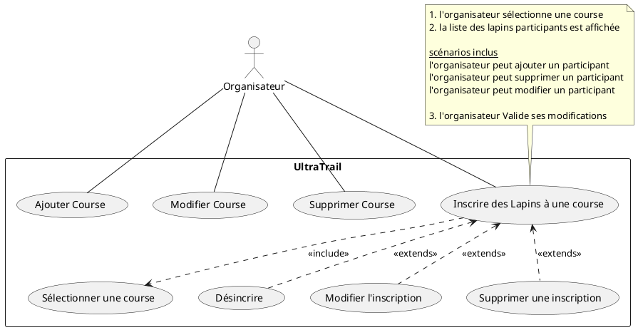

# UltraTraildesLapins 

Contexte : Pour la préparation des courses des lapins une application sera créer pour la gestion. 
## 1. Architecture du projet

* model : représente les classes métiers, la logique métier de la programmation
* dao : permet d'organiser la persistance des données dans une base de données. D'autres
choix techniques auraient pu être envisagés (fichier texte, json, csv...)
* view : les vues représentent l'interface organisateur de l'application. Elles sont réalisées
en fonction des maquettes écrans proposées ainsi que des cas d'utilisation retenus.

L'architecture du projet est le MVC :

Model-View-Controller.


Base de données :

```Sql
drop database if exists dbUtdl;
create database dbUtdl;

use dbUtdl;

create table Course (
    id int(11) unsigned not null auto_increment,
    distance int(11) unsigned not null,
    index(id)  
);

create table Lapin (
    id int not null auto_increment,
    surnom varchar(20) not null,
    position int(11) unsigned,
    dossard int(11) unsigned,
    age int(11) unsigned not null,
    idCourse int(11) unsigned not null,
    index(id)
);

alter table Course add constraint pk_Course primary key (id);
alter table Lapin add constraint pk_Lapin primary key (id);
alter table Lapin add constraint fk_Lapin_Participer_Course foreign key (idCourse) references Course(id);
alter table Lapin add index idx_idCourse (idCourse);

```

Cas d'utilisation :





Prévoir une énumération permet de qualifier l'état d'une instance, en lien avec la couche Dao.

```csharp
public enum State { added, modified, deleted, unChanged };
```

## 2. L'application

La fenêtre principale : 


Le boutton une course nous permet de gérer les courses :


Nous pouvons créer, modifier, supprimer et voir les courses.

Création d'une course en appuyant sur le bouton add :


La course a bien été créée :


Modification de la course numéro 1 en lui ajoutant une dsitance de 1000 m :


Résultat :


Revenons sur notre menu principal cliquons sur LesCourses :


Le boutton LesCourses permet de gérer les lapins qui participent aux courses.

Nous avions précédemment créée une course nous la retrouvons dans cette fenêtre nous pouvons voir aucun particpant pour le moment :


Nous allons créer 2 participants Jeanmi & Billy pour la course numéro 1:


Pour une visualisation de l'application nous créons une nouvelle course de 800 m:


pour cette nouvelle course nous avons créer des nouveaux participants :


### Évolution :

Une potentiel évolution pourra être faîtes, un jeu de paris de course sur les lapins avec une visualisation de la course en direct.

