# UltraTraildesLapins 

Contexte : For preparing the rabbits' shopping list, an application will be created for management.

## 1. Project Architecture

* model : Represents the business logic and the core programming logic.
* dao : Handles the organization of data persistence in a database. Other technical choices, such as text files, JSON, or CSV, could have been considered.
* view : The views represent the application's user interface. They are created based on the proposed screen mockups and selected use cases.

The project architecture follows the MVC: Model-View-Controller.


Database :

```Sql
drop database if exists dbUtdl;
create database dbUtdl;

use dbUtdl;

create table Course (
    id int(11) unsigned not null auto_increment,
    distance int(11) unsigned not null,
    index(id)  
);

create table Lapin (
    id int not null auto_increment,
    surnom varchar(20) not null,
    position int(11) unsigned,
    dossard int(11) unsigned,
    age int(11) unsigned not null,
    idCourse int(11) unsigned not null,
    index(id)
);

alter table Course add constraint pk_Course primary key (id);
alter table Lapin add constraint pk_Lapin primary key (id);
alter table Lapin add constraint fk_Lapin_Participer_Course foreign key (idCourse) references Course(id);
alter table Lapin add index idx_idCourse (idCourse);

```

Use Case :


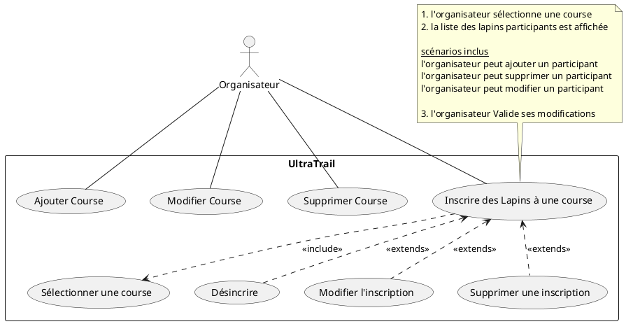


Consider implementing an enumeration to define the state of an instance, in relation to the DAO layer.

```csharp
public enum State { added, modified, deleted, unChanged };
```

## 2. application

Main Window : 

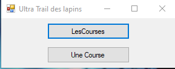

The "Une Course" button allows us to manage the races :

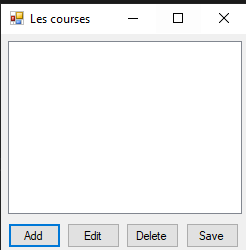

We can create, modify, delete, and view races.

Creating a Race by Clicking the Add Button :

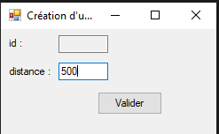

The race has been successfully created :

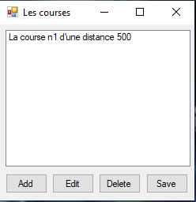

Modifying Race Number 1 by Adding a Distance of 1000m :

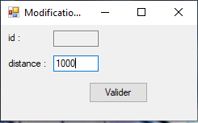

Result :

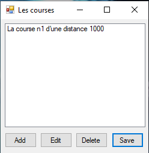

Back on the main menu, click on "Les Courses" :


The "Les Courses" button allows us to manage the rabbits participating in the races.

We previously created a race, which can now be seen in this window, and there are currently no participants :


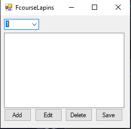

We will now create two participants, Jeanmi & Billy, for race number 1 :

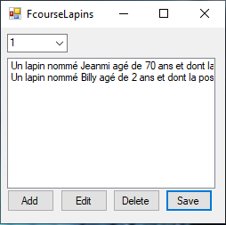

For a better visualization of the app, we create a new race of 800 m :

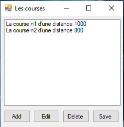

For this new race, we have created new participants :

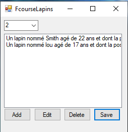

### Future Evolution :

A potential evolution could be the addition of a betting game for the rabbit races, along with live race visualization.
